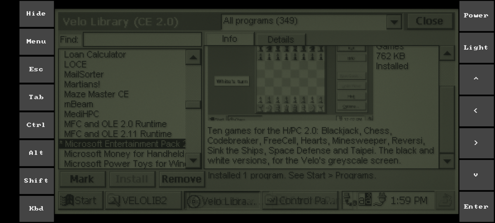
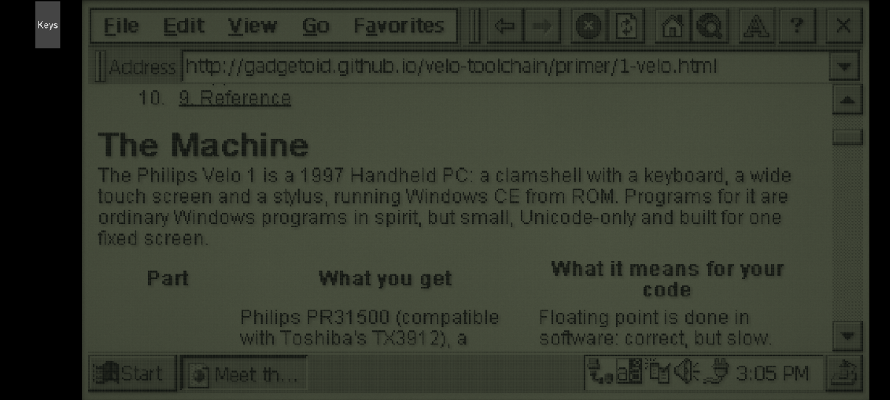
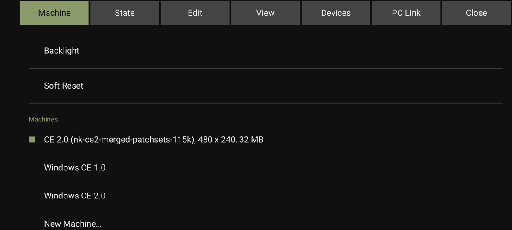
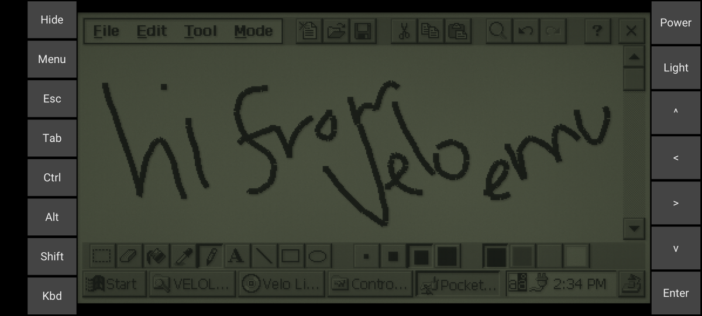

# velo-emu

An emulator for the Philips Velo 1 (1997), a Windows CE Handheld PC. It runs the stock CE 1.0 ROM and the CE 2.0 upgrade, with a simulated backlit LCD, PC Card images, a PPP network with a web proxy for Pocket IE, and the desktop connection tools of the day. Unlike [CERF](https://github.com/gweslab/cerf), which it draws on, it runs on macOS, Linux and Android.


With the CE 2.0 upgrade's applications, a library of period software on a PC Card, and Microsoft Entertainment Pack 2.0 installed from it:


## Getting started

### Install

- **macOS (Apple silicon):** `Velo.app`, from a release or `make app` (see Building). It isn't notarised, so macOS blocks a downloaded copy the first time it opens: allow it in System Settings > Privacy & Security > Open Anyway, or run `xattr -dr com.apple.quarantine Velo.app`. A copy built with `make app` opens normally. `velo-rapi` and `velo-state` are inside it, in `Velo.app/Contents/MacOS`.
- **Debian 12 or later and Ubuntu 24.04 or later:** the `.deb`, from a release or `tools/mkdeb.sh`. It installs `velo`, `velo-headless`, `velo-rapi` and `velo-state`, with a desktop entry.
- **Android (arm64, Android 9 or later):** the `.apk` from a release, or `make apk` (see Building). See Android.
- **From source:** see Building.

### ROMs

No ROMs are included. Put them in the `roms` folder of the data folder, under any names:

- macOS: `~/Library/Application Support/Velo/roms`
- Linux: `~/.local/share/velo-emu/roms`

Two systems are supported:

- **Windows CE 1.0:** the 7,799,876-byte `nk.bin` from CERF's `philips_velo_1_ce1` bundle.
- **Windows CE 2.0:** the Velo's CE 2.0 upgrade was a ROM Miniature Card, with its applications (Pocket Word, Pocket Excel and the rest) on a CompactFlash card in the PC Card slot. A merged image puts those applications in ROM too, which leaves the PC Card slot free for apps and games. The upgrade's ROM on its own, from CERF's `philips_velo_1_ce2` bundle (4,185,248 bytes), also runs, with the applications on a CompactFlash card image (see PC Card storage).

Each file is identified by its contents. With more than one image for a system, one built by velo-emu-ce-2.0 with its patch sets is used first (for CE 2.0, one with `pc-link-115k` ahead of one without; its `\Windows\velo-emu-ce-2.0.txt` lists the sets and the system, and only counts when that system matches the ROM's own), then the larger image, so a merged image wins over the upgrade's ROM on its own. New Machine marks the patched images. With no ROMs in the folder, a dialog shows its location, with a button to open it.

### First run

Open the app, or run `velo`. It starts the last machine used. Each machine is a ROM plus fixed hardware (screen size and memory) with its own saved state; Machine > New Machine… makes one and the machines are listed in the Machine menu, which switches between them. The first launch makes a Windows CE 1.0 and a Windows CE 2.0 machine from the ROMs in the roms folder, keeping any existing saved states. `--machine=NAME` opens a machine by name. A ROM on the command line runs that ROM instead, with its own saved state outside the machine list:

```
velo
velo ~/roms/nk.bin
velo --memory=32 --serial=net --card=apps.img nk-ce2-merged.bin
velo --help
```

A first boot goes through the setup wizard: touch calibration, time zone, date and owner. The mouse is the stylus; hold it on each calibration target for about half a second. Host keys map to the Velo keyboard. With "Set the clock from this computer" (on by default when making a machine) the clock starts at the host's time, so pick your home city in the wizard and it's right.

On macOS the menus are in the menu bar. On Linux they're in a bar along the top of the window, F10 opens it, and the arrow keys, Enter and Escape move through it.

## Using it

| Menu | Item | Shortcut |
|---|---|---|
| Machine | Power Button (suspend and resume) | Cmd-Shift-P |
| Machine | Backlight (presses the Velo's backlight key) | Cmd-B |
| Machine | Soft Reset (restarts CE, keeping RAM and the object store, like the reset button) | Cmd-R |
| Machine | Machines: the machine list (switching saves the current machine and opens the other), New Machine…, Manage Machines… (Reset… back to the factory state, Delete…) | |
| Machine | Pause | Cmd-P |
| Machine | CPU Speed: 1x (original), 2x, 4x, 8x, and Optimisations | |
| Machine | Show Debug Output | |
| State | Save State, Load State | Cmd-S, Cmd-L |
| State | Save Snapshot…, Load Snapshot… | Cmd-Ctrl-S, Cmd-Ctrl-L |
| State | Show State Folder | |
| Edit | Copy Screen (a PNG of the screen as shown) | Cmd-C |
| Edit | Paste as Typing (types the clipboard; curly quotes and dashes become plain ones, other characters are skipped) | Cmd-V |
| Edit | Save Screenshot to Desktop | Cmd-Shift-S |
| View | 50%, 75%, Actual Size, 150%, 200%; Zoom In and Zoom Out | Cmd-0, Cmd-=, Cmd-- |
| View | Simulated LCD (glass, ghosting and backlight) or Sharp Pixels (plain greys, one per screen pixel) | |
| View | Full Screen | Cmd-Ctrl-F |
| Devices | PC Card: Insert Card Image…, Eject Card | Cmd-O, Cmd-E |
| Devices | Paravirtual Disk: Insert Disk Image…, New Disk Image…, Eject Disk (needs the guest driver) | |
| Devices | Serial Port: Not Connected, Network (PPP), Pseudo-terminal, Host Serial Port (the detected ports) | Cmd-Shift-N for Network |
| Devices | Connect Network at Launch | |
| Devices | Sound | |
| PC Link | Send Files to Velo…, Copy My Documents to Mac… | |
| PC Link | Shared Folder…, Sync Shared Folder Now, Stop Sharing Folder | |
| PC Link | Velo Settings: Set Up Pocket IE Proxy, Connection Speed (19200 (original), 38400, 57600, 115200) | |

Shortcuts use Cmd on macOS and Ctrl+Alt on Linux, so Cmd-Shift-P is Shift+Ctrl+Alt+P; plain Ctrl and Alt go to the Velo. On Linux Full Screen is F11, the snapshot items have no shortcut, and desktops that lock the screen with Ctrl+Alt+L take that one from Load State. Linux menus say Computer for Mac and Pictures for Desktop, where screenshots go, and Machine has a Quit item (Ctrl+Alt+Q).

CE 1.0 and 2.0 have no scroll wheel, so scrolling (a mouse wheel or two-finger scroll) presses the arrow keys instead: it scrolls Pocket IE and lists, and moves the caret in documents.

Dropping files on the window sends them to `\My Documents`, a dropped `.load` script installs its package, and a single dropped `.img` is inserted as the card.

The backlight is under CE's control: the backlight key toggles it, and the Backlight control panel's idle timeout turns it off (30 seconds by default, since the Velo reports external power).

## Android






The first run asks for ROMs and card images, from the phone's storage or Downloads, and copies them into the app; Machine > Import ROMs and Cards… adds more later. A finger is the stylus. In landscape the controls run down both sides of the screen and in portrait across the top, leaving room for the keyboard below:

- **Hide** folds them into a Keys tab and gives the screen the full height.
- **Menu**, or Back, opens the menus above as tabs. The ones that need a desktop (zoom, full screen, the pseudo-terminal and host serial ports) are left out.
- **Kbd** opens the phone's keyboard, which types on the Velo. Ctrl, Alt and Shift stay down until tapped again, so Alt-Tab is Alt, Tab, Alt.
- **Esc**, **Tab**, the arrows and **Enter** are the Velo's keys, and **Power** and **Light** its power and backlight buttons.

Notices that the desktop shows in the title bar appear at the bottom of the screen. The unlit screen is dimmed to look like the Velo's reflective LCD; with the backlight on, the phone runs at full brightness (View > Full Brightness with Backlight turns that off). The phone stays awake while the Velo is on.

Picked card, disk and snapshot files are copied into the app, under `Android/data/org.velo_emu.velo/files/velo-emu`, and a saved snapshot goes where you choose. Save Screenshot puts it in Pictures/Velo, and Share Screen… shares it. PC Link's Shared Folder… and Copy My Documents… need All files access, which they ask for, and choose a folder in the phone's storage. Leaving the app saves the machine.

## Saved state and snapshots

Each ROM has its own saved machine, `state-ROM-HASH.bin` in the data folder. It's saved on quit, every minute and by Save State, and restored on launch with the clock advanced by the time away; `--fresh` cold boots instead, and `--state=FILE` uses FILE for loading, saving and autosaving. Load State returns to the last save. A state only loads with the ROM it was made with, and states from older builds load, with any new fields at their defaults; one that can't be read is renamed with `.old` appended. States are saved gzip-compressed (a 33 MB machine saves as about 2 MB); uncompressed states from older builds still load, but older builds can't read compressed ones.

Snapshots are named copies of the machine, in `snapshots` in the data folder by default. Loading one is a restore point: autosave carries on to the ROM's own state.

Backups go in `snapshots/Backups`: a copy of the machine every 10 minutes it runs, and one just before a reset, Load State and Load Snapshot… replace it, and before a machine is deleted, and before `--fresh` starts over the saved state. The newest 10 per state are kept. Load one with State > Load Snapshot….

If a serial cable was connected when the state was saved, the restored machine starts with it unplugged and plugs it back in two seconds later, so CE dials again instead of reusing a PPP session that no longer exists. If the state's card image has gone, the card starts out ejected and a newly inserted one goes in a second later, so CE registers the removal first.

`velo-state` reads a saved state's RAM files and registry without running it, for states that won't boot, or to compare two:

```
velo-state state.bin ls "/Program Files"
velo-state state.bin get Samples/Letter.pwd
velo-state state.bin reg dump HKLM/Drivers
velo-state before.bin diff after.bin
```

Paths, keys and output follow `velo-rapi`. Files in ROM aren't listed, and databases aren't read. On CE 1.0 the registry comes from `\Windows\Pegreg.reg`, as filesys last wrote it. The store's format is in [docs/object-store.md](docs/object-store.md).

The data folder also holds `emu.ini` (settings), `rapi.sock` and the shared folder's sync manifest. `XDG_DATA_HOME` and `XDG_CONFIG_HOME` override its location, as the tests do; on Linux `emu.ini` is in `~/.config/velo-emu`. On macOS the first launch moves an older `~/.local/share/velo-emu` and `~/.config/velo-emu/emu.ini` into `~/Library/Application Support/Velo`.

## PC Card storage

The PC Card slot takes a CompactFlash (ATA) card backed by a raw disk image. CE 1.0 mounts it as `\PC Card` and CE 2.0 as `\Storage Card`. Make one, optionally copying folders onto it:

```
tools/mkcard.sh card.img 32 ~/Downloads/SOFTWARE
velo --card=card.img
```

It uses `hdiutil` on macOS and `sfdisk`, `mkfs.fat` and `mtools` on Linux. Insert it with Devices > Insert Card Image… or `--card=IMAGE`; the image path is kept in the saved state. Inserting over a card ejects the old one and inserts the new one a second later. To change its contents on the host, eject it first; on macOS `hdiutil attach -imagekey diskimage-class=CRawDiskImage card.img` mounts it, and on Linux `mcopy -i card.img@@512` copies to and from it.

A new machine's first boot inserts the Velo Software Library card from the `cards` folder in the data folder (`~/Library/Application Support/Velo/cards`, `~/.local/share/velo-emu/cards`): the one with a `VELOLIB` folder for CE 1.0, or `VELOLIB2` for CE 2.0. After that the machine keeps whatever card it has.

### Paravirtual disk (experimental)

A disk separate from the PC Card slot, backed by an image file you can swap while the Velo runs. It's emulator-only hardware (a few registers and a sector buffer at physical `0x10800000`) with a small driver, `guest/vdisk`, that registers a disk with CE's FATFS when an image is inserted and removes it when it's ejected.

- CE 2.0 mounts it as a storage card folder alongside a PC Card: whichever mounts first is `\Storage Card`, the other `\Storage Card2`.
- CE 1.0 mounts it as `\PC Card`. CE 1.0 only mounts one FAT volume, so use either the paravirtual disk or a PC Card storage card, not both.

The driver is one of the Guest Additions in `guest/` (see `guest/README.md`), which velo-emu-ce-2.0 can also build into a card or ROM. Build them with velo-toolchain (`make guest`, which looks for it in `../velo-toolchain`; set `VELO_TOOLCHAIN=PATH` otherwise). The driver lands in `build/guest/vdisk/ce1` and `ce2`. Install the one for the system once, over RAPI with the machine connected, then soft reset:

```
velo-rapi put build/guest/vdisk/ce2/vdisk.dll /Windows/vdisk.dll
velo-rapi reg set HKLM/Drivers/BuiltIn/VDisk Dll string vdisk.dll
velo-rapi reg set HKLM/Drivers/BuiltIn/VDisk Entry string VDiskStart
velo-rapi reg set HKLM/Drivers/BuiltIn/VDisk Keep dword 1
velo-rapi reg set HKLM/Drivers/BuiltIn/VDisk Order dword 3
```

The CE 2.0 upgrade ROM on its own has no RAPI server; tested on CE 1.0 and the merged CE 2.0 image.

Then use Devices > Insert Disk Image…, New Disk Image… (a blank 32 MB image, which the Velo offers to format) and Eject Disk, or `--disk=IMAGE` at launch. The driver checks for changes twice a second and mounts once the shell is up. Any `mkcard.sh` image works. The image path is kept in the saved state. Headless has `--disk=IMAGE`, `--insert-disk=SECONDS:IMAGE` and `--eject-disk=SECONDS`.

## Serial and networking

Devices > Network (PPP), or `--serial=net`, plugs COM1 into a built-in PPP server on a libslirp user-mode network. Connecting the cable starts CE's own desktop connection: CE sends `CLIENT`, the emulator responds with `CLIENTSERVER`, and PPP comes up with the Velo at 10.0.2.15, the host at 10.0.2.2 and DNS at 10.0.2.3. CE's sockets reach the host and the internet (outgoing only); 10.0.2.2 is the host's loopback.

Devices > Pseudo-terminal, or `--serial=pty`, puts COM1 on a pty and prints its path in the title bar and on stderr, for a terminal or PPP tools.

Devices > Host Serial Port, or `--serial=/dev/cu.usbserial-XXXX`, connects COM1 to a real port: the menu lists `/dev/cu.*` on macOS and `/dev/ttyUSB*` and `/dev/ttyACM*` on Linux, refreshed as devices come and go. The port is raw, with no flow control and modem lines ignored, and follows the baud rate CE sets (nearest standard rate). It's kept as `serial_device=` in `emu.ini`.

Without libslirp the build still works, with no Network (PPP) option.

### PC Link

With PPP up, CE connects to the desktop at 10.0.2.2 port 5679, as it did with Handheld PC Explorer, and the emulator accepts the connection, sending the ping CE 2.0 requires every few seconds. The desktop then reaches the Velo with RAPI, CE's remote API, on its port 990, which the emulator makes available as `rapi.sock` in the data folder, with no TCP port. The protocol follows [SynCE](https://sourceforge.net/projects/synce/)'s librapi2.

The PC Link menu uses it:

- Send Files to Velo… copies files into `\My Documents`, and Copy My Documents to Mac… copies `\My Documents`, with its folders, into a host folder.
- Shared Folder… pairs a host folder with `\My Documents` and syncs them each time the Velo connects, or with Sync Shared Folder Now. A file changed on one side is copied to the other. A file deleted on one side, and unchanged on the other since the last sync, is deleted there too (to the Trash). When both sides changed a file, the host keeps its copy and the Velo's arrives as `name (Velo).ext`. Uploads that don't fit in the Velo's free storage are skipped, and empty folders aren't removed. The pairing is kept as `shared_folder=` in `emu.ini`.

`velo-rapi` does the same from the command line while the emulator is running with Network (PPP) connected. It gives up after 5 seconds if the Velo doesn't answer, and after 30 seconds of silence once connected (`--timeout=SECONDS` changes that):

```
velo-rapi info
velo-rapi ls
velo-rapi put notes.txt
velo-rapi get Samples/Letter.pwd
velo-rapi run /Windows/pword.exe
velo-rapi sync ~/Velo
velo-rapi reg dump HKCU/Software/Apps/PocketIE
velo-rapi --help
```

Velo paths are relative to `\My Documents` unless they start with `/` or `\`; both separate folders. Registry keys start with `HKCU`, `HKLM`, `HKCR` or `HKU`. `--socket=PATH` picks another socket, such as one from `velo-headless --rapi=PATH`. CE 2.0's stock ROM lacks `rapisrv.exe`, the RAPI server; without it CE 2.0 reports "Out of Memory" when the cable is connected.

PC Link > RAPI over the Network also accepts RAPI connections on port 9990 (`rapi_port` in `emu.ini`) on every network interface, so other computers, or a Mac talking to the Android app, can use it: `velo-rapi --connect=HOST:9990 put tool.exe /Windows/tool.exe`. The menu shows the address to use. Connections are passed to the Velo as if from the desktop, which CE 2.0's RAPI server insists on. `velo-headless --rapi-port=PORT` does the same.

CE's desktop connection runs at 19200 baud, about 1.6 KB/s. PC Link > Connection Speed, or `velo-rapi baud 115200`, makes a faster connection the PC Connection (on CE 1.0 it adds a hidden `` `Desktop @ 115200` `` connection to the registry; CE 2.0 has its own `` `Serial Port @ `` ones), and the menu ticks the speed in use; the menu then reconnects the cable after about 10 seconds, as CE only picks up the change if the old connection has had time to settle, and with `velo-rapi` it applies from the next connection. The speed is kept in the Velo's registry, so it lasts as long as the machine's saved state. At 115200 the emulated CPU sets the pace: about 1.9 KB/s at CPU Speed 1x and 5.8 KB/s at 4x.

### Installing CE 1.0 software

CE 1.0 programs were installed from Windows by H/PC Explorer, which ran a `.load` script for each package over RAPI. `velo-rapi load SCRIPT [DEST]`, or dropping the script on the window, does the same: it copies files (taking the `.mips` build where there is one), creates folders, shortcuts and registry keys, writes registry strings and numbers and starts programs. `.` in the script is the script's folder as a source and DEST as a destination; `%P` is DEST, and `~ ~` is `HKEY_LOCAL_MACHINE\Software\Apps\APPNAME`. DEST and APPNAME come from an `Install.inf` beside the script (`InstallDir` and `AppName`), otherwise DEST is `\Program Files\Accessories` and APPNAME the script's name. `execOnUnload` is skipped, as there's no uninstall.

For example, Microsoft's Power Toys 1.0 for CE 1.0 (Cascading Menus, Mute, Pocket Paint, sound schemes, wallpapers, control panel annunciators and Remote Control). `powtoy.exe` is in archive.org's [Windows CE 1.0 Programs](https://archive.org/details/windowsce1.0) collection. It's an InstallShield 3 package: extract the two embedded archives with [unshieldv3](https://github.com/wfr/unshieldv3), then run each component's script:

```
python3 -c 'import struct,sys; d=open("powtoy.exe","rb").read(); p=0xcc00
while True:
    n=struct.unpack_from("<I",d,p)[0]
    if not 0<n<260: break
    size=struct.unpack_from("<I",d,p+8+n)[0]; blob=d[p+12+n:p+12+n+size]; p+=12+n+size
    if blob[:4]==b"\x13\x5d\x65\x8c": open("part%d.Z" % p,"wb").write(blob)'
mkdir powertoys
unshieldv3 extract "$(ls -S part*.Z | head -1)" powertoys
for s in annun/Annunciator cascade/Cascade mute/Mute ppaint/Ppaint rcontrol/remotecontrol sound1/Analog sound2/Metallic sound3/Organic wall/Wallpaper; do
    velo-rapi load powertoys/$s.load
done
```

Cascading Menus and Mute start straight away in the taskbar, Paint is in Programs > Accessories, the schemes are in Volume & Sounds and the wallpapers in Display. Remote Control needs its Windows desktop half.

### Web proxy

Pocket IE doesn't support modern HTTPS, so the network has a web proxy at 10.0.2.4 port 8080 that fetches pages with libcurl on the host. PC Link > Set Up Pocket IE Proxy, or `velo-rapi proxy on`, sets it in the Velo's registry for Pocket IE's next start; CE 2.0 picks it up after a soft reset. By hand: in Pocket IE, View > Options > Proxy Server, tick Use Proxy Server, enter `10.0.2.4` and port `8080`. Only Pocket IE's requests use it, and it opens no port on the host. Google search refuses browsers this old; [DuckDuckGo Lite](http://lite.duckduckgo.com/lite/) works.

Type addresses as `http://`: Pocket IE makes `https://` connections itself, not through the proxy, and they fail. For `http://` addresses without a port the proxy tries HTTPS first, then plain HTTP. Before a response reaches the Velo it:

- rewrites `https://` links and redirects to `http://`, so they come back through the proxy
- removes `<script>`, `<style>`, `<svg>` and comments, which Pocket IE would show as text
- converts UTF-8 text to Windows-1252 and drops the charset
- drops `Secure` from cookies and maps 303, 307 and 308 redirects to 301 and 302
- turns PNG, JPEG, GIF, BMP and SVG images into four-grey dithered GIFs, at the size the page's `` gives and at most 436 pixels wide, the widest Pocket IE shows unscaled. Other formats, such as WebP, pass through unchanged.
- gzips anything else it passes through unchanged, such as JSON, if the request has `Accept-Encoding: gzip`. Pocket IE doesn't send it.

It sends a Lynx user agent upstream in place of Pocket IE's, which some sites block, and sites generally serve text browsers their simplest pages. Set it with `user_agent=` in `emu.ini` or `--user-agent=TEXT`; an empty value passes Pocket IE's own through. Through the proxy, `127.0.0.1` is the host's loopback.

## Machines, clock, memory, screen and speed

Machine > New Machine… picks the name (left blank, it's made from the other settings), the ROM (from the roms folder, or Other ROM File… for any other, such as a patched or merged image), the screen size, the memory and whether to set the clock from the host. These are fixed for the life of the machine. Machine > Manage Machines… resets a machine to its factory state or deletes it; both back up its state first, and the running machine can't be deleted. Machines are kept as `machines/*.ini` in the data folder, each with its saved state beside it, and switching or quitting saves the machine.

A machine made with the clock set from the host gets the host's time at a cold boot. CE starts at noon on 1 January (1996 for CE 1.0, 1997 for CE 2.0) in its default time zone, Pacific; with the option on, the emulator gives it the host's time in Pacific time, so once you pick your home city the clock is right. After that the clock keeps running while the emulator is closed, and survives a soft reset.

Memory is the machine's RAM, or `--memory=` for a ROM given on the command line. CE uses at most 16 MB of built-in RAM; 20 MB and 32 MB add a 16 MB DRAM Miniature Card, the Velo's own memory expansion, which CE maps as a second RAM region (20,348 KB and 32,636 KB in Control Panel > System). CE 2.0 needs 12 MB, so give it 20 or 32; CE 2.0 machines get 32 MB unless New Machine says otherwise. A saved machine keeps the memory it was booted with.

Screen is the machine's display size, or `--screen=WxH` for a ROM given on the command line. The emulator patches the display setup in the loaded ROM (the kernel's LCD controller setup and GWES's or the display driver's size, stride and framebuffer), keeping the original refresh rate, and moves the framebuffer out of the way of the larger image. CE 1.0 runs at any of the sizes; the merged CE 2.0 image at up to 640 x 480; the CE 2.0 upgrade ROM on its own at 640 x 240, as its display driver faults at taller sizes. Sizes a ROM can't run are greyed out in New Machine. The ROM files aren't changed, and a saved machine keeps the screen it was booted with. Some of CE's own dialogs, such as the setup wizard's, keep their 480 x 240 layout.

CPU Speed runs that many instructions per 36.864 MHz clock tick; `--speed=` does the same. Timers, the RTC, the LCD, sound and serial stay on the real clock, so only the CPU gets faster.

CPU Speed > Optimisations (`--optimisations=on`, on by default on Android) does some of CE's work natively and skips work that only waits for time to pass:

- CE 1.0's LZW and CE 2.0's LZ ROM compression run natively, with the same results as CE's own code. CE uses them to load programs and files from ROM and for its RAM object store.
- When CE keeps polling the RTC or `GetTickCount` until the time changes, the CPU waits for the next tick instead. This never skips past an interrupt or input.

With it off, the emulation matches the original instruction for instruction.

## Headless

`velo-headless` (`headless` in a source build) runs the machine without a window, for tests and scripts. Input happens at emulated times, and runs are deterministic: the same ROM, state and options give the same screen.

```
velo-headless nk.bin --seconds=12 --key=8:4B --tap=12:240:120 --pgm=out.pgm
velo-headless nk.bin --seconds=3 --load=state.bin --save=state.bin
velo-headless nk.bin --seconds=10 --load=state.bin --power=2 --power=6 --wav=out.wav
velo-headless nk-ce2-merged.bin --load=state.bin --tap=4:120:40 --png=screen.png --png-backlight=on
velo-headless --help
```

`--help` lists every option. Some details:

- `--tap=SECONDS:X:Y[:HOLD]` holds the pen for 0.5 s by default; use 0.08 for double taps. `--key` takes a Velo scancode in hex (the backlight key is 5E), or up to four joined with `+` to press together, such as `19+11` for Alt-Tab, and `--type` types text with `\n` for Enter.
- `--pgm=FILE` saves the raw greyscale screen, and `--png=FILE` saves it through the simulated LCD, as the GUI draws it.
- `--net=SECONDS` connects the PPP network, `--rapi=SOCKET` makes the Velo's RAPI port available for `velo-rapi --socket`, and `--realtime[=N]` paces the run at N times real time for anything driving it over RAPI (unpaced, an idle Velo runs about 1000 times faster). `--cable` and `--cable-send` connect a bare serial cable and send bytes down it. `--replug=SECONDS` unplugs the `--net` cable and plugs it back in two seconds later.
- `--watch-pc=VA` logs registers each time the CPU reaches an address; below 0x02000000 it matches in any process slot.
- `--debug-output` prints CE's debug output (see Debug output).
- `--gdb=PORT` and `--gdb-process=NAME` wait for GDB before running (see Debugging with GDB).
- SIGTERM or SIGINT ends a run early and still writes `--save`, `--pgm`, `--png` and `--wav`.

Unknown options, malformed values and events past the end of a run are errors or warnings, rather than being ignored. All three tools take `--help` and `--version`, and options that take a value accept `--name=VALUE` or `--name VALUE`.

## Debug output

CE's debug output, from `OutputDebugString` in programs and the kernel's own messages (its boot banner, and a register dump when a program crashes), goes to `debug.log` in the data folder, which Machine > Show Debug Output opens. `velo --debug-output` and `headless --debug-output` also print it to stderr. The retail ROMs build these messages and then drop them, so the emulator reads each string where the OAL's `OEMWriteDebugString` would have sent it to the debug port. CE 1.0 also gates the kernel's messages behind a flag, so they're read where `NKDbgPrintfW` drops them. The log is moved to `debug.log.old` at launch once it passes 1 MB.

## Debugging with GDB

`headless --gdb=PORT` waits for GDB on 127.0.0.1:PORT before running, and then runs until GDB detaches or kills it, or until `--seconds` if that's given. `velo --gdb=PORT` listens while the Velo runs, and GDB can attach and detach at any time. Machine > GDB Server does the same on port 1234 (`gdb_port` in `emu.ini`) on every network interface, and is remembered, so GDB on another computer can reach the emulator, including the Android app over Wi-Fi: `target extended-remote 192.168.1.20:1234`. With velo-toolchain's debugmgr in `\Windows\StartUp` (copy it with `velo-rapi --connect`), `remote put` and `run` work there too. Any GDB with MIPS support works as the client: `gdb-multiarch` on Linux, or Homebrew's `gdb` on macOS.

```
velo-headless nk.bin --load=state.bin --card=card.img --gdb=2159 --gdb-process=maths.exe
gdb maths.elf -ex 'target remote :2159'
```

Breakpoints and watchpoints are kept by the emulator, so guest memory isn't changed, and memory reads and writes go through CE's own page tables for the process being debugged. Every process runs at the same low addresses, so `--gdb-process=NAME`, or `monitor process NAME` in GDB, picks one: a breakpoint below 0x02000000 then only stops there. If the process isn't running yet, GDB stops when it starts.

When a program crashes, GDB stops with SIGSEGV, SIGBUS, SIGILL, SIGFPE or SIGTRAP at the faulting instruction, with the registers as they were. CE has already started its own handling by then, so continuing lets CE end the program. CE's debug output appears in GDB while it runs.

DLLs the process loads are reported to GDB, which loads symbols for them from the `.elf` beside each DLL (`set solib-search-path` to the build folder), so breakpoints in a DLL work before it's loaded. `monitor modules` lists the loaded modules with an `add-symbol-file` command for each.

`monitor help` lists the rest: `processes`, `process`, `modules`, `libraries elf|dll`, `catch on|off` and `output on|off`. This works on CE 1.0 and 2.0. Threads aren't reported to GDB yet; it sees one thread, the one that's running.

With velo-toolchain's `debugmgr.exe` running on the Velo (see Host mailbox), GDB can also copy files and start programs. The stub sends debugmgr requests through the mailbox itself, so it needs no `--agent`, and the two can be used together:

```
gdb maths.elf -ex 'target extended-remote :2159'
(gdb) remote put maths.exe /Windows/maths.exe
(gdb) set remote exec-file /Windows/maths.exe
(gdb) break WinMain
(gdb) run
```

`target remote` debugs the whole machine as it's running. `target extended-remote` starts with no process, as `gdbserver --multi` does, so IDEs such as VS Code's C/C++ extension start the program rather than attach. `remote put`, `remote get` and `remote delete` go through debugmgr, and so does reading the program's file when GDB asks for it. `run` starts the program, debugs that process and stops when it starts; `kill` ends it, and GDB is told when it exits. GDB treats `\` in `remote put` and `remote get` paths as an escape, so use `/` (the stub turns it into `\`) or double it. While a request is being handled the Velo runs, so other programs carry on. If debugmgr doesn't answer, GDB is told file transfer isn't supported and falls back to local files.

The stub also supports GDB's non-stop protocol, so with `maint set target-non-stop on` GDB can list threads and read memory while the program runs, which IDEs do. VS Code's C/C++ extension needs `miDebuggerServerAddress` and `"useExtendedRemote": true` in the launch configuration as well, or it treats the program as a local process and its Pause and Stop do nothing.

## Host mailbox

An emulator-only message pipe between a program running on the Velo and a tool on the host, for agents such as velo-toolchain's debug manager that transfer and launch programs faster than RAPI. The emulator only passes messages; what they mean is up to the agent and its host tool.

In the guest, `break 0x51CE` (the word `0x0014738D`, not in a delay slot) from user mode is handled by the emulator before CE sees it, and execution continues after it. `a0` is the operation, `a1` a buffer in the calling process and `a2` its length or capacity; the result is in `v0`.

| `a0` | Operation | Result |
| --- | --- | --- |
| 0 | Probe | `v0` = interface version (1), `v1` = largest message (65536) |
| 1 | Receive into `a1`, up to `a2` bytes | the message's length, 0 if none is waiting, or minus its length if it's bigger than `a2` (it stays queued) |
| 2 | Send `a2` bytes from `a1` | `a2`, or -1 if no host tool is connected or the message is too big |

On the host, `headless --agent=SOCKET` and `velo --agent=SOCKET` listen on a Unix socket for one client at a time. Each message is a little-endian 32-bit length followed by the bytes, in both directions. Messages wait in a queue of 64 each way and are dropped when the client disconnects. Probe always answers, with or without `--agent`, and it keeps working in a state saved with the agent running. Buffers are read and written through CE's page tables; one that isn't paged in yet is faulted in by CE first, so it can fail like any memory access would, for example while the card an agent runs from is still being mounted after a load.

## Windows CE 2.0 details

The Velo 1's CE 2.0 upgrade shipped as a ROM Miniature Card. An `nk.bin` whose single ROM header spans the whole file is mapped at the header's `physfirst` (0x90001000, the card window at physical 0x10000000) and started there, as the Velo's boot block would hand off to the card; the first 4 KB of the card, missing from the dump, reads as erased flash. A B000FF image also loads, with records in the card window and the internal ROM window at 0x1F400000. CE 2.0 runs the LCD in 16 greys.

The Velo 1's internal ROM is an 8 MB chip, at 0x1F400000 and mirrored every 8 MB from 0x1F000000 to 0x1FFFFFFF, with zeros after the CE 1.0 image, so its boot block at 0x1FC00000 is the start of `nk.bin`. Images larger than the chip, such as merged CE 2.0 ones, aren't mirrored. Reset (Start > Run, `reset`, or after an install) jumps to the boot block, and the emulator does a warm reset there: CE restarts from the ROM's entry with RAM kept, so it keeps its object store and loads newly installed drivers.

In CE 1.0's `fatfs.dll`, the function that sizes a direct multi-sector write computes the bytes left in a contiguous cluster run as `run_end - (pos - run_start)` instead of `run_end - pos`, so a large write into a fragmented card runs over other files. The emulator patches that instruction in the loaded ROM (0x9F5B4FCC), not the file, and only if the original is there.

## Building

macOS:

```
brew install sdl3 libslirp
make            # velo, velo-rapi and velo-state
make headless
make app        # Velo.app, with its icon, its Homebrew libraries bundled and an ad-hoc signature
make apk        # dist/velo.apk for Android, with the NDK, SDK and a JDK from Homebrew
make apk-install # install it on the phone over adb, and start it
make apk-push   # replace a debug install's native code without reinstalling
```

`make apk` needs `brew install --cask android-ndk android-commandlinetools`, `brew install openjdk@21 meson ninja` and `sdkmanager "platforms;android-35" "build-tools;35.0.0"`. `tools/android-deps.sh` cross-builds GLib, libslirp, mbedTLS and curl into `build/android` the first time. Without a release key, the APK is a debug build signed with `~/.android/debug.keystore`. `make apk-install` installs with the Play Store as the installer, which gets past phones that block USB installs, such as Xiaomi's. `make apk-push` works because a debug build loads a newer `libmain.so` from its private files when there is one.

Debian 13, or Ubuntu with `libsdl3-dev`:

```
sudo apt install build-essential pkg-config libsdl3-dev libslirp-dev libcurl4-openssl-dev zlib1g-dev mtools dosfstools fdisk
make && make headless
sh tools/mkdeb.sh dist    # the .deb, with dependencies from dpkg-shlibdeps
```

Without `libsdl3-dev` (Debian 12, Ubuntu 24.04), build a static SDL3 first. That needs `cmake`, `curl`, `libglib2.0-dev` (for libslirp's pkg-config file) and the X11, Wayland and audio development packages, as listed in `.github/workflows/build.yml`:

```
sh tools/sdl3-static.sh
PKG_CONFIG_PATH=build/sdl3/lib/pkgconfig make SDL_STATIC=1 all headless
```

libslirp 4.7, 4.8 and 4.9 all work. GitHub Actions builds `Velo.app`, the `.deb` (on Debian 12 with a static SDL3, so it also installs on Debian 13 and Ubuntu 24.04 or later) and the Android `.apk` for each push to `main` and each pull request, runs `make check`, and attaches them to a release for each `v*` tag. The APK is signed with the release key in the `ANDROID_KEYSTORE` (base64), `ANDROID_KEYSTORE_PASSWORD` and `ANDROID_KEY_ALIAS` secrets, or with a throwaway debug key without them. `make apk` takes the same key from `APK_KEYSTORE`, `APK_KEYSTORE_PASSWORD` and `APK_KEY_ALIAS`.

Tests:

- `make check` needs no ROMs: the command lines, and the web proxy's rewriting and image conversion.
- `make test` runs the full suite against `rom/nk.bin` (CE 1.0) and `rom/nk-ce2.bin` (the CE 2.0 upgrade's ROM on its own, optional), or `make test ROM=PATH CE2_ROM=PATH`. It boots both systems through the wizard to the desktop and compares framebuffer hashes at each step, and tests saved states, suspend and resume, cards, memory sizes, the clock, PPP, the web proxy in Pocket IE, RAPI file transfer, sync, registry setup, `.load` scripts and reading saved states with `velo-state`.

## What's emulated

- CPU: MIPS-I interpreter with the TX39 CP0, 32-entry TLB and branch-likely instructions (`src/core/mips.c`).
- PR31500 (`src/core/machine.c`):
  - interrupt controller, including the high-priority encoder
  - periodic timer, RTC and alarm
  - power, with STOPCPU idle, the stop timer and suspend (clock stop, resume in place, woken by the power button or an enabled interrupt)
  - LCD controller (2 and 4 bpp, VIDEO_CTL7 shade map), with the frame and DF interrupts and the power controller's VIDRF video clock divider
  - SPI
  - SIB subframe 0 and sound transmit DMA (half and end interrupts, 16-bit high byte first)
  - I/O and MFIO
- Velo 1 board:
  - 4 to 16 MB DRAM, and the 16 MB DRAM Miniature Card in slot 1 with its I2C ID EEPROM (MFIO 18/20)
  - keyboard controller enable packet and scancodes
  - UCB1100 touch and battery ADC
  - debug module probe
  - M-Module (IT8368) ID
  - LCD panel power on MFIO 17 (active low) and the backlight on MFIO 25
  - M-Module IT8368E PC Card socket (card detect, power, reset, interrupt to the IR block's CARDET) and the PR31500 card windows
  - CompactFlash card in ATA mode (CIS, task file, PIO read and write)
  - UART A (COM1) with its circular receive DMA, CTS on MFIO 30 and DCD on IO 4 (active low)

Guest time is the instruction count at 36.864 MHz. Registers that aren't modelled read back the last value written; `--verbose` logs accesses to them.

Not emulated: sound input, UART B, IrDA, PC Cards other than CompactFlash, and Miniature Cards other than the DRAM card and the CE 2.0 ROM card.

## Licence

MIT, see `LICENSE`. ROMs and Windows CE software are not included.

## Credits

Peripheral behaviour, the memory map and the keyboard table follow [CERF](https://github.com/gweslab/cerf) (MIT, `licences/MIT-CERF.txt`). The web proxy decodes images with [stb_image](https://github.com/nothings/stb) (public domain) and [nanosvg](https://github.com/memononen/nanosvg) (zlib, `licences/Zlib-nanosvg.txt`), which also draws the icon from `assets/velo.svg`. The Linux menu bar draws text with [stb_truetype](https://github.com/nothings/stb) (public domain) and the system's sans-serif font.
